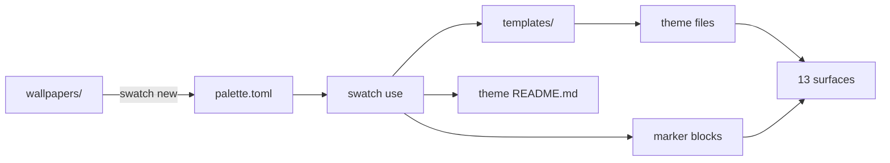

```
███████╗ ██╗    ██╗  █████╗  ████████╗  ██████╗ ██╗  ██╗
██╔════╝ ██║    ██║ ██╔══██╗ ╚══██╔══╝ ██╔════╝ ██║  ██║
███████╗ ██║ █╗ ██║ ███████║    ██║    ██║      ███████║
╚════██║ ██║███╗██║ ██╔══██║    ██║    ██║      ██╔══██║
███████║ ╚███╔███╔╝ ██║  ██║    ██║    ╚██████╗ ██║  ██║
╚══════╝  ╚══╝╚══╝  ╚═╝  ╚═╝    ╚═╝     ╚═════╝ ╚═╝  ╚═╝
```

<div align="center">

### `ONE PALETTE // TWELVE SURFACES // ONE COMMAND`

*a wallpaper picks the colors, a TOML file locks them, and every app on the machine agrees*


</div>

---

## 🎨 What is this

Theming a desktop by hand means the same hex code lives in fourteen files, and
changing your mind means finding all fourteen. Swatch replaces that with one
`palette.toml` per theme and a compiled CLI that writes every surface from it:
terminal, editors, status bar, file manager, browser, wallpaper.

Swatch never rewrites a config it doesn't own. Apps with a theme-file mechanism
get a generated file plus one pointer line; apps without one get a block between
`# swatch:start` and `# swatch:end` markers and nothing else is touched. A
pointer edit that matches zero lines or two lines is an error, not a guess.

**This repo is the engine, not a rice.** Your themes are yours: they live in
`~/.config/swatch/themes/`, or wherever `SWATCH_THEMES` points, so you can keep
them in a repository of their own and share them without shipping the tool.

```console
nick@mba:~$ swatch use batman-jazz
Batman Jazz
  ✓ ghostty (supacode reads this config; p10k + fastfetch inherit its ANSI)
  ✓ btop
  ✓ borders
  ✓ wallpaper (dusk-late.jpg, 5 spaces)
  ✓ sketchybar
  ✓ yazi
  ✓ glow
  ✓ zed
  ✓ vscode (restart VS Code to pick it up)
  ✓ cava
  ✓ lazygit
  ✓ zen (restart Zen to pick it up)
  ✓ cider
```

## 🔧 The surfaces

Three mechanisms cover everything. Which one a surface gets depends on what the
app supports, not on preference.

| | mechanism | what it actually does |
|---|---|---|
| 01 | **pointer flip** | swatch writes a theme file next to the config and swaps one line to name it: ghostty, btop, glow, zed, vscode, yazi |
| 02 | **marker injection** | app has no theme-file support, so swatch owns the block between `swatch:start` and `swatch:end` and leaves the rest alone: sketchybar, borders, cava, lazygit, zen |
| 03 | **key edit** | the app owns its config outright and rewrites it wholesale, so swatch sets only the keys that make it read a palette colour: cider |
| 04 | **osascript per Space** | the wallpaper. System Events' "desktop" means *display*, so swatch walks the Spaces with yabai and sets each one |
| 05 | **free** | p10k and fastfetch contain zero hex codes and inherit the terminal's remapped ANSI 16 |

| | command | what it actually does |
|---|---|---|
| 01 | `swatch list` | themes on disk, unfinished scaffolds marked as such |
| 02 | `swatch use <theme>` | applies everything, skips apps that aren't installed, regenerates the theme's README |
| 03 | `swatch status` | the same code path with writes disabled, tells you which files have drifted |
| 04 | `swatch new <name> ...` | samples the first wallpaper into a palette scaffold and marks the accent TODO |

Swatch refuses to apply any palette containing the string `TODO`.

## 🚀 Run it

Needs [Bun](https://bun.sh) and macOS. Every themed app is optional, swatch
skips what isn't installed.

```bash
git clone https://github.com/nitrimandylis/swatch.git
cd swatch
bun run compile   # → ~/.bun/bin/swatch, and man swatch into your manpath
swatch
man swatch        # full reference, offline
```

Clone it wherever you like; nothing is baked into the binary. Themes are read
from `~/.config/swatch/themes/` unless `SWATCH_THEMES` says otherwise:

```bash
# keep them in their own repo
git clone git@github.com:you/my-themes.git ~/.config/swatch/themes

# or point at a checkout you already have
export SWATCH_THEMES=~/code/my-themes
```

A theme is a directory holding `palette.toml` and a `wallpapers/` pool. Building
one starts from the image:

```bash
swatch new "Copper Dusk" ~/Pictures/dusk.jpg
# edit copper-dusk/palette.toml, the accent is yours to pick
swatch use copper-dusk
```

One palette, many pictures: a theme is a set of colors, and a wallpaper is a
mood inside it. Add more whenever you find them, by path or piped from anything
that prints paths.

```bash
swatch add copper-dusk ~/Pictures/dusk-*.jpg
fzf -m --preview 'chafa {}' | swatch add copper-dusk -   # swatch never learns where your wallpapers live
```

`swatch use copper-dusk` then opens an fzf menu with chafa previews, unless the
theme holds exactly one picture. Escape changes nothing at all: the menu runs
before any config is written. Scripts skip it with `--pick`, which takes either
a number from `swatch list copper-dusk` or a filename:

```bash
swatch list copper-dusk          #   1. dusk.jpg
                                 #   2. dusk-late.jpg
swatch use copper-dusk --pick 2
swatch use copper-dusk --pick dusk-late.jpg   # survives the pool growing
```

With no terminal to draw on, no fzf installed, or `--pick` given, no menu opens:
swatch keeps the wallpaper already on screen when it belongs to the theme, and
otherwise takes the first. So a re-apply never yanks you off the picture you
chose, and nothing needs a state file to remember it.

## 🧪 Extraction, and what it can't do

Extraction recovers structure, never identity. It walks the image's luminance
range for base, surface, overlay, muted and text, and takes the most saturated
color in the lower half as `deep`. The accent is always left `TODO`. Two themes
built this way show why:

- Against a Nord wallpaper it returns `#2e3440` for `base`, which is nord0 to
  the byte, and lands within a few units on `text` and `deep`. Structure holds up.
- Against the Firewatch wallpaper the two accent candidates, the amber in the
  tower window and the magenta treeline, are 0.137% and 4% of the image. The
  amber is gone entirely by the time it is sampled at 96px, and choosing between
  them is a judgement about what the picture is *of*, not a measurement.

No amount of sampling recovers the second one, which is the whole argument for
leaving that field blank.

## 🔩 Under the hood



| layer | path | job |
|---|---|---|
| cli | `swatch.ts` | palette validation, the surface table, all three mechanisms |
| documents | `templates/` | the long color files, embedded into the binary at compile time via `with { type: "text" }`, so nothing is read from disk at runtime |
| tests | `swatch.test.ts` | the pure logic: hex conversion, BMP parsing, chroma ranking, marker injection |
| fixtures | `test/themes/` | one fake theme, so the tests never need your real ones |
| man page | `man/swatch.1` | hand-written roff, installed by `bun run compile` |

**Stack:** bun · typescript · zero runtime dependencies · sips · osascript

### Notes worth keeping

- **JankyBorders reloads live.** `bordersrc` is only read at launch, but running
  `borders <options>` reconfigures an instance that is already up, so swatch does
  that instead of asking for `brew services restart borders`. Running it with no
  instance would start one in the foreground and block, hence the `pgrep` guard.
- **glow and lazygit don't read `~/.config`.** They use Go's
  `os.UserConfigDir`, which on macOS is `~/Library`. Both are symlinked back to
  `~/.config`, which is where swatch writes.
- **`theme` and `config-file` are the only keys banned inside a ghostty theme
  file**, so `background-opacity` lives there too. Any color left inline in
  `config` overrides the theme, which is why the migration removed them.
- **sketchybar font pinning:** `icon_map.sh` and the installed
  `sketchybar-app-font.ttf` must be the same release (currently `v2.0.62`), an
  older font renders newer app tokens as tofu.
- **sketchybar PATH:** `colors.sh` prepends Homebrew so the brew-service launchd
  env can find `yabai` and `sketchybar`.
- **yabai coupling:** `external_bar all:37:0` reserves the strip; window signals
  trigger `space_windows_change` to refresh the space icons.
- **yazi filetype rules key on `url`/`mime`**, not `name`, in v25+.
- **Zen's live profile** is the one named by `[InstallXXX] Default=` in
  `profiles.ini`. The `Default=1` flag on a `[ProfileN]` section can point at an
  empty profile.
- **Set Zen's variables, don't paint its elements.** `#zen-main-app-wrapper`
  draws the outer chrome from `--zen-themed-toolbar-bg-transparent`, which
  resolves to literally `transparent` in some modes, so styling only
  `#navigator-toolbox` and `.browserContainer` leaves the workspace gradient
  showing down the sides of the window. Setting the variable instead means every
  colour Zen derives with `color-mix()` follows along.
- **Cider owns its settings file and rewrites it from memory.** Every save
  serialises the whole of `spa-config.yml` from the running app, so an edit made
  while Cider is open is reverted with no error. Swatch checks `pgrep -x Cider`
  and tells you to quit and reopen. Cider also needs `useSystemAccentColor:
  false` and `customAccentColor: true` set, or the accent it is given is
  ignored, which is why the surface writes flags as well as colours.
- **Cider's background stays Cider's.** `backgroundBlurMap.src` can be pointed
  at the theme's wallpaper, and it works, but Cider re-serialises the path
  without quotes while swatch writes it with them, so `status` then reports
  drift on a file that is correct. Matching another program's YAML quoting rules
  is a bug waiting for its next release, and the solid background looks better.
- **A "desktop" in System Events is a display, not a Space.** One monitor with
  five Spaces reports `count of desktops` = 1, so `set picture of every desktop`
  changes exactly one wallpaper. Spaces each keep their own, in
  `~/Library/Application Support/com.apple.wallpaper/Store/Index.plist`, keyed by
  Space UUID. Swatch walks them with yabai instead of writing that store.
- **Setting a Space's wallpaper is asynchronous at both ends.** The Space switch
  is animated, and WallpaperAgent commits the write after `osascript` has already
  returned. Fixed delays around those two steps looked correct and then missed
  two Spaces out of five; swatch polls `has-focus` and then `get picture of
  desktop 1` instead.
- **Dynamic wallpapers are HEIC files** carrying `apple_desktop:solar` or `:h24`,
  and macOS often names them `.jpg`. `swatch new` takes the extension from
  `sips -g format` and warns, because one palette cannot track a wallpaper that
  changes with the sun.

---

<div align="center">

**[Nick Trimandylis](https://github.com/nitrimandylis)**

`PICK THE COLOR ONCE`

MIT licensed, see [LICENSE](LICENSE).

</div>
