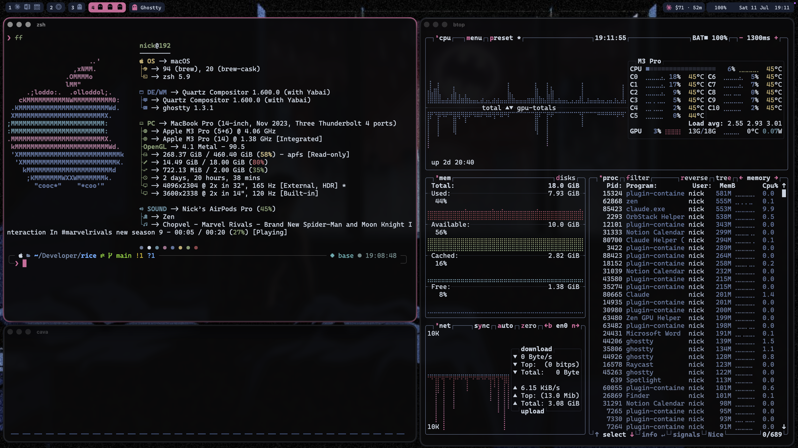

# rice — Batman Jazz

A single fixed neon-noir theme derived from `batman jazz.jpg`, applied across my
terminal, prompt, TUIs, editors, and browser. Near-black room, steel-blue
midtones, crimson sky, one hot neon-pink bat-signal accent.

*Scene: yabai bsp tiling with pink JankyBorders + gaps, transparent SketchyBar
(spaces w/ app-icon strips, Apple Music, Claude usage, battery, clock),
fastfetch + btop + cava in Ghostty. Dock auto-hidden.*

- **Palette:** [`PALETTE.md`](./PALETTE.md) — the locked hexes + ANSI-16 set.
- **Source of truth:** this repo holds the palette + wallpaper. The actual
  configs live in their normal locations and are versioned by `dt` (dovetail)
  into `~/.dotfiles`. This repo is docs, not a config mirror.

## What got themed

| Surface | How |
|---|---|
| ghostty | `~/.config/ghostty/config` — 16-color palette, `opacity 0.92` + blur, Cascadia Code NF |
| p10k | `~/.p10k.zsh` — light touch: dir→steel, git→accent family, prompt char→pink (ANSI indices) |
| btop | `~/.config/btop/themes/batman-jazz.theme` + `color_theme` in `btop.conf` |
| cava | `~/.config/cava/config` — gradient steel floor → hot pink |
| fastfetch | `config.jsonc` — logo tinted; keys inherit remapped ANSI |
| zed | `settings.json` — `theme_overrides` chrome over Nord Dark syntax, Cascadia font |
| vscode | `settings.json` — `workbench.colorCustomizations` chrome + terminal ANSI, Cascadia font |
| Zen | `user.js` accent `#e85a9c` + `chrome/userChrome.css` noir tint |
| borders | `~/.config/borders/bordersrc` — JankyBorders, active `#e85a9c` / normal `#20252f`, `style=round width=5.0`. Runs as a brew service alongside yabai. |
| sketchybar | `~/.config/sketchybar/` — grouped-pill top bar. Left: yabai spaces w/ app-icon strips (active = accent fill) + front app. Right: Apple Music now-playing, Claude Code daily cost, RAM, battery, clock. Cascadia Code NF + sketchybar-app-font. Brew service. |
| yazi | `~/.config/yazi/theme.toml` — palette roles across mgr/mode/status/pick/etc. Real image previews via Ghostty's kitty graphics protocol (`chafa` fallback). |
| glow | `~/.config/glow/batman-jazz.json` (glamour style) + `glow.yml`. Headings pink, code tan-on-steel, links cyan. |
| lazygit | `~/.config/lazygit/config.yml` — active border accent, inactive steel, surface selection, nerd icons. |

## TUI toolkit notes

- **macOS config paths:** yazi reads `~/.config/yazi` directly, but glow and
  lazygit read `~/Library/…` (Go's `os.UserConfigDir`), not `~/.config`. The
  editable sources live in `~/.config`, symlinked into place:
  `~/Library/Preferences/glow/glow.yml` and
  `~/Library/Application Support/lazygit/config.yml`.
- yazi filetype rules key on `url`/`mime` (not `name`) in v25+.

## SketchyBar notes

- **Fonts:** text/symbols `Cascadia Code NF`, app glyphs `sketchybar-app-font`
  (ligature tokens like `:ghostty:`). **Pin `icon_map.sh` and the installed
  `sketchybar-app-font.ttf` to the same release** (currently `v2.0.62`) — a font
  older than the map renders newer app tokens as tofu boxes.
- **yabai coupling:** `external_bar all:37:0` reserves the strip; window
  signals trigger `space_windows_change` to refresh the space icons.
- **Claude widget:** `plugins/claude.sh` runs `ccusage` via `bun` (avoids
  nvm's versioned node) for today's cost, plus session limit % and reset
  countdown from Anthropic's OAuth usage endpoint (token from Keychain
  `Claude Code-credentials`) — ccusage's guessed 5-hour blocks don't match
  the real window. macOS menu bar set to auto-hide.
- **PATH:** `colors.sh` prepends Homebrew to PATH so the brew-service launchd
  env can find `yabai`/`sketchybar`.

## Reproduce / change

Configs are ANSI-index-driven where possible, so ghostty's `palette` is the one
lever that re-tints the whole terminal (p10k, fastfetch, btop TTY, etc. inherit
it). To tweak a color, edit `PALETTE.md`, update the relevant config, then
`dt backup <app>`. Revert any surface with `dt undo <app>`.
