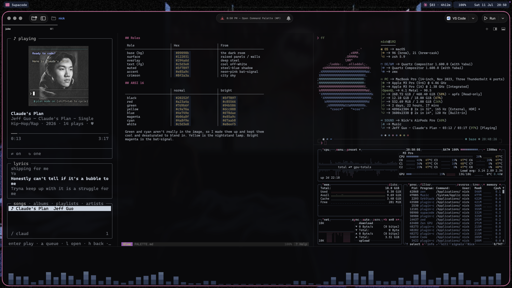
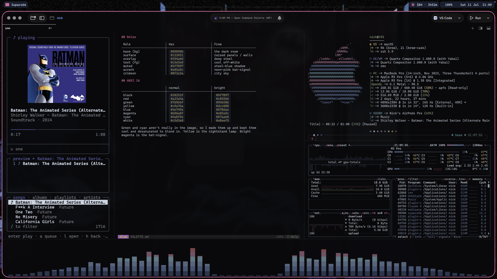
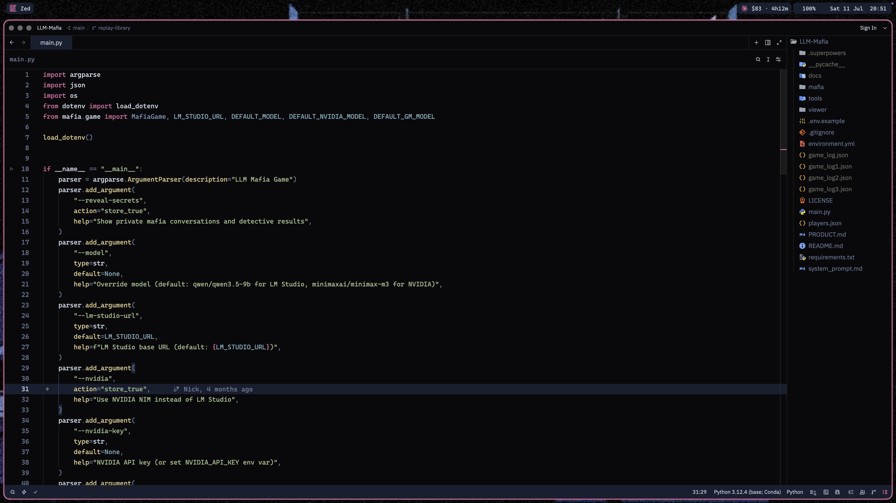
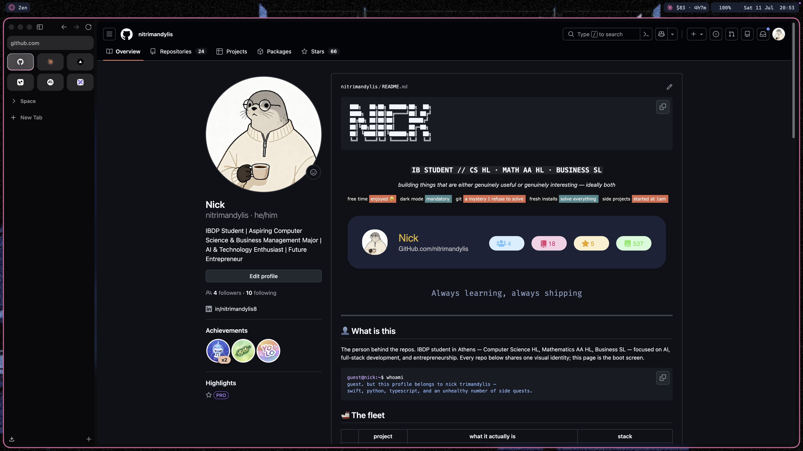
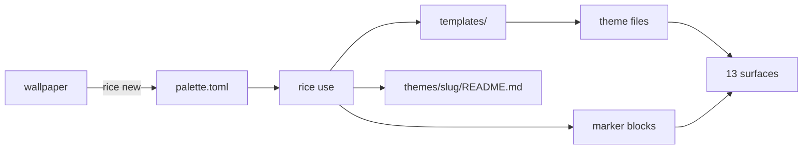

```
 ██████╗  ██╗  ██████╗ ███████╗
 ██╔══██╗ ██║ ██╔════╝ ██╔════╝
 ██████╔╝ ██║ ██║      █████╗
 ██╔══██╗ ██║ ██║      ██╔══╝
 ██║  ██║ ██║ ╚██████╗ ███████╗
 ╚═╝  ╚═╝ ╚═╝  ╚═════╝ ╚══════╝
```

<div align="center">

### `ONE PALETTE // THIRTEEN SURFACES // ONE COMMAND`

*a wallpaper picks the colors, a TOML file locks them, and every app on the machine agrees*


</div>

---

## 🦇 What is this

Theming a desktop by hand means the same hex code lives in fourteen files, and
changing your mind means finding all fourteen. This repo replaces that with one
`palette.toml` per theme and a compiled CLI that writes every surface from it —
terminal, editors, status bar, file manager, browser, wallpaper.

Rice never rewrites a config it doesn't own. Apps with a theme-file mechanism
get a generated file plus one pointer line; apps without one get a block between
`# rice:start` and `# rice:end` markers and nothing else is touched. A pointer
edit that matches zero lines or two lines is an error, not a guess. Dovetail
(`dt`) still owns the configs themselves, so `dt undo` reverts anything rice got
wrong.

Batman Jazz is theme one: a near-black room, steel-blue midtones, and a
neon-pink bat-signal, a color which is not actually in the wallpaper. Firewatch
and Nord followed, extracted from their own images.

```console
nick@rice:~$ rice use batman-jazz
Batman Jazz
  ✓ ghostty (supacode reads this config; p10k + fastfetch inherit its ANSI)
  ✓ btop
  ✓ borders
  ✓ wallpaper (wallpaper.jpg)
  ✓ sketchybar
  ✓ yazi
  ✓ zed
  ✓ vscode (restart VS Code to pick it up)
  · vicinae not set up here, skipped
```

## 🎨 The surfaces

Three mechanisms cover everything. Which one a surface gets depends on what the
app supports, not on preference.

| | mechanism | what it actually does |
|---|---|---|
| 01 | **pointer flip** | rice writes `themes/<slug>` next to the config and swaps one line to name it — ghostty, btop, glow, zed, vscode, vicinae, yazi |
| 02 | **marker injection** | app has no theme-file support, so rice owns the block between `rice:start` and `rice:end` and leaves the rest alone — borders, cava, lazygit, zen |
| 03 | **osascript per Space** | the wallpaper — System Events' "desktop" means *display*, so rice walks the Spaces with yabai and sets each one |
| 04 | **free** | p10k and fastfetch contain zero hex codes and inherit the terminal's remapped ANSI 16 |

| | command | what it actually does |
|---|---|---|
| 01 | `rice list` | themes on disk, unfinished scaffolds marked as such |
| 02 | `rice use <theme>` | applies everything, skips apps that aren't installed, regenerates the theme's README |
| 03 | `rice status` | the same code path with writes disabled — tells you which files have drifted |
| 04 | `rice new <name> ` | samples a wallpaper into a palette scaffold and marks the accent TODO |

Rice refuses to apply any palette containing the string `TODO`.

## 📸 Evidence

<details>
<summary>batman jazz, the whole desk</summary>


*wallpaper, sketchybar, and nothing else in the way*


*juke, glow, fastfetch, btop and cava, all reading the same sixteen colors*


*same grid with the music actually playing*


*zed, on a real theme file rather than chrome overrides*


*zen, tinted through user.js and userChrome.css*

</details>

## 🚀 Run it

Needs [Bun](https://bun.sh) and macOS. Every themed app is optional — rice skips
what isn't installed.

```bash
git clone https://github.com/nitrimandylis/rice.git
cd rice
bun run compile   # → ~/.bun/bin/rice, and man rice into your manpath
rice list
rice use batman-jazz
man rice           # full reference, offline
```

Building a new one starts from an image:

```bash
rice new "Copper Dusk" ~/Pictures/dusk.jpg
# edit themes/copper-dusk/palette.toml — the accent is yours to pick
rice use copper-dusk
```

Extraction recovers structure, never identity. It walks the image's luminance
range for base, surface, overlay, muted and text, and takes the most saturated
color in the lower half as `deep`. The accent is left as `TODO`, and the two
themes built this way show why:

- Against the Nord wallpaper it returns `#2e3440` for `base`, which is nord0 to
  the byte, and lands within a few units on `text` and `deep`. Structure holds up.
- Against the Firewatch wallpaper the two accent candidates — the amber in the
  tower window and the magenta treeline — are 0.137% and 4% of the image. The
  amber is gone entirely by the time it is sampled at 96px, and choosing between
  them is a judgement about what the picture is *of*, not a measurement.

No amount of sampling recovers the second one, which is the whole argument for
leaving that field blank.

## 🔩 Under the hood



| layer | path | job |
|---|---|---|
| cli | `rice.ts` | palette validation, the surface table, all three mechanisms |
| documents | `templates/` | the long color files — embedded into the binary at compile time via `with { type: "text" }`, so nothing is read from disk at runtime |
| themes | `themes/<slug>/` | `palette.toml`, wallpaper, screenshots, and a generated README |
| tests | `rice.test.ts` | the pure logic — hex conversion, BMP parsing, chroma ranking, marker injection |
| man page | `man/rice.1` | hand-written roff, installed by `bun run compile` |

**Stack:** bun · typescript · zero runtime dependencies · sips · osascript

### Notes worth keeping

- **JankyBorders reloads live.** `bordersrc` is only read at launch, but running
  `borders <options>` reconfigures an instance that is already up, so rice does
  that instead of asking for `brew services restart borders`. Running it with no
  instance would start one in the foreground and block, hence the `pgrep` guard.
- **glow and lazygit don't read `~/.config`.** They use Go's
  `os.UserConfigDir`, which on macOS is `~/Library`. Both are symlinked back to
  `~/.config`, which is where rice writes.
- **`theme` and `config-file` are the only keys banned inside a ghostty theme
  file**, so `background-opacity` lives there too. Any color left inline in
  `config` overrides the theme, which is why the migration removed them.
- **sketchybar font pinning:** `icon_map.sh` and the installed
  `sketchybar-app-font.ttf` must be the same release (currently `v2.0.62`) — an
  older font renders newer app tokens as tofu.
- **sketchybar PATH:** `colors.sh` prepends Homebrew so the brew-service launchd
  env can find `yabai` and `sketchybar`.
- **yabai coupling:** `external_bar all:37:0` reserves the strip; window signals
  trigger `space_windows_change` to refresh the space icons.
- **yazi filetype rules key on `url`/`mime`**, not `name`, in v25+.
- **Zen's live profile** is the one named by `[InstallXXX] Default=` in
  `profiles.ini`. The `Default=1` flag on a `[ProfileN]` section points at an
  empty profile here.
- **A "desktop" in System Events is a display, not a Space.** One monitor with
  five Spaces reports `count of desktops` = 1, so `set picture of every desktop`
  changes exactly one wallpaper. Spaces each keep their own, in
  `~/Library/Application Support/com.apple.wallpaper/Store/Index.plist`, keyed by
  Space UUID. rice walks them with yabai instead of writing that store.
- **Setting a Space's wallpaper is asynchronous at both ends.** The Space switch
  is animated, and WallpaperAgent commits the write after `osascript` has already
  returned. Fixed delays around those two steps looked correct and then missed
  two Spaces out of five; rice polls `has-focus` and then `get picture of
  desktop 1` instead.
- **Dynamic wallpapers are HEIC files** carrying `apple_desktop:solar` or `:h24`,
  and macOS often names them `.jpg`. `rice new` takes the extension from
  `sips -g format` and warns, because one palette cannot track a wallpaper that
  changes with the sun.

---

<div align="center">

**[Nick Trimandylis](https://github.com/nitrimandylis)**

`PICK THE COLOR ONCE`

MIT licensed — see [LICENSE](LICENSE).

</div>
